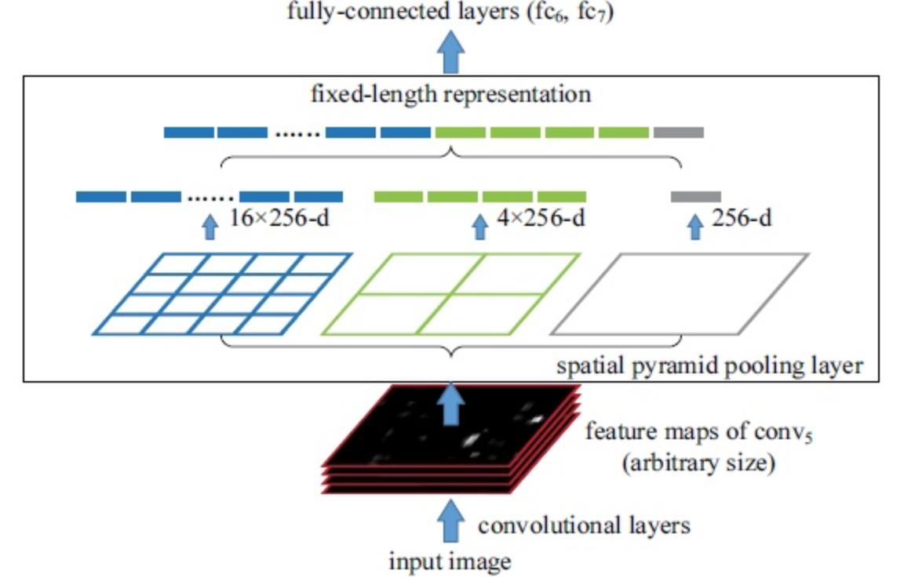
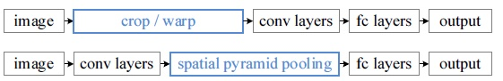

# Object Detection學習筆記 -- SPP(spatial pyramid pooling)Net

##Why SPPNet?

在上篇R-CNN中，有一些顯著的缺點：

* 速度瓶頸：每幅圖片我們都需要經過selective search的特徵提取以得到2k左右個region proposal，這個過程非常耗時。
* 性能瓶頸：我們把每個region proposal都縮放到一樣的尺寸(224x224)，因此幾何形狀必定會被扭曲，而且由於速度瓶頸的關係，我們也難以採用data augmentation以及multi-scale的訓練。

第二點中，為了不用將原始輸入圖像去縮放為固定尺寸，利用在FC前加入一層可以對任意size的輸入產生固定size的輸出，一個簡易的方法就是加入一個pooling，而這個pooling的kernel size以及stride都是相對值，以對應到固定的輸出大小。

而SPPNet根據此思路，加入spatial pyramid pooling，即一張圖片，我們將其劃分為多個尺度，並且每個利用上述的方式輸出固定大小，並且concate在一起後即可串到後面的FC layer中，整個網路架構如下圖所示。

此處spp分為三個尺度：4x4, 2x2以及1x1三種，注意此圖中的256代表了feature map的數目，這些經過pooling後得到了16+4+1=21的向量。

不過這個方法仍舊要利用selective search得到所有的candidate region，但是相對於原始的R-CNN在每個candidate region上單獨進行縮放後丟到CNN的操作(也就是若每張圖有2000個region，一張圖就要做2000次CNN)，SPPNet則選擇在feature map上去抽取特徵。

綜合以上，整個訓練流程如下：

1. 利用selective search獲得2K個region
2. "原始圖像"通過CNN得到featrue map，並且在feature map中找到1.所對應的region，這些region每個都做一次SPP(recall:每個region有在conv5有256個feature，分三種尺度，得到長度為21的向量)
3. 做bounding box regression，FC輸出的向量丟到SVM中分類

將R-CNN(上)和SPPNet(下)做個比較：

## 如何將selective search得到的ROI對應到CNN提取的ROI?

對於一個任意的region proposal S我們將其映射到feature map中，實際上我們只需要紀錄左上角以及右下角兩個點即可，設將S中的x,y映射到x', y'，假設S的寬與高分別為Sx及Sy，則x' = floor(x / Sx) + 1且y' = ceil(y / S) - 1