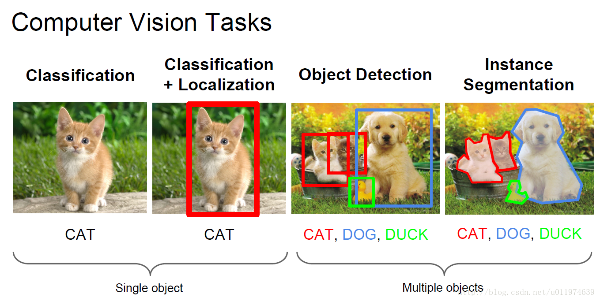
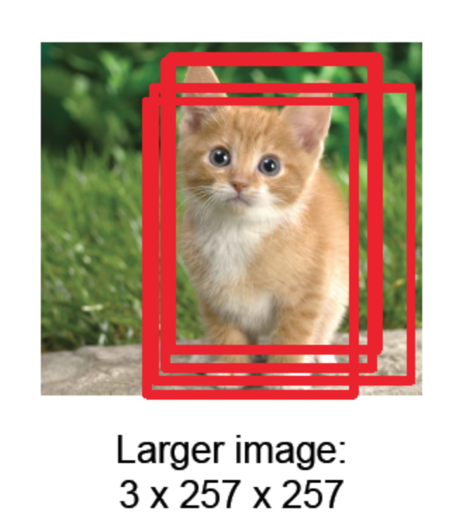
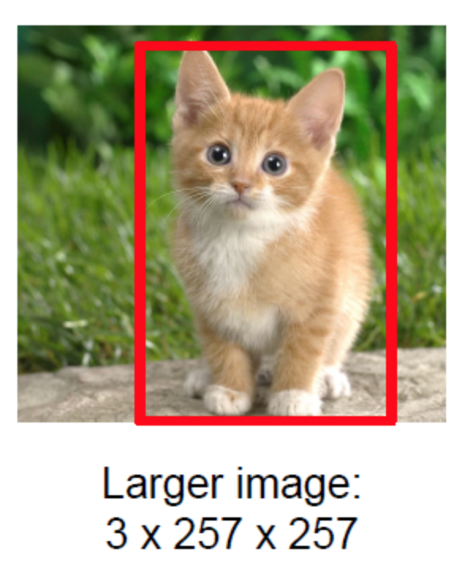
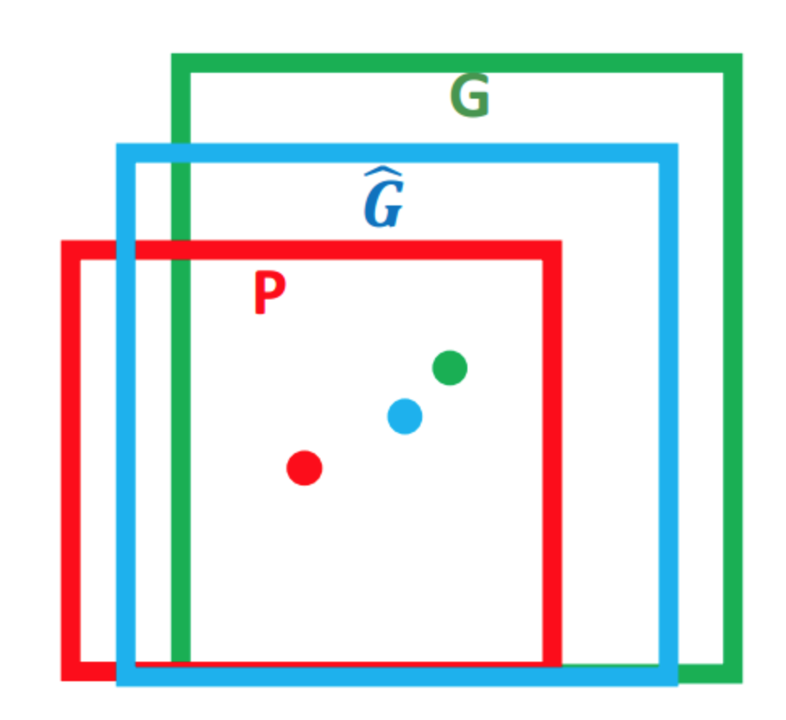

# Object Detection學習筆記 -- 基礎知識

在object detection中，有一些技術是大家常常會用到的，本篇目的在於先補足這些object detection領域的共通語言。共會介紹Bounding Box(bbox), Intersection over Union(IoI), Non-Maximum Suppression(NMS),Bounding Box Regression的定義及用途。

## What is Bounding Box?

直接上圖最清楚

bbox即為"包含物體"的"最小矩形"，也就是object detection那欄的box。

而記錄這些box我們需要四個數據：(x,y,w,h)，x,y代表了bbox的左上角，w,h分別代表了bbox的寬和高，這四個數字唯一決定了一個bbox。

## What is IoU?

對於兩個Region R, R'，其重疊的程度我們利用下式來衡量：

>$O(R, R') = \cfrac{|R\cap R'|}{|R\cup R'|} $

圖示即為：

也就是說，這個可以用來衡量預測出來的bbox與ground truth是否相近。

## What is NMS?
一樣，先看圖

經過NMS之後得到：

也就是所有包含目標物件的bbox中，我們選擇信心度最高的那個bbox，並且去除那些與其IoU太高的bbox。

整個procedure如下：

B = [bboxes]

KEEP = []

1. 根據confidence排序B

2. 找出confidence最高的bbox，加到KEEP中，接著B.pop()

3. 對於其他所有bbox，與2的IoU大於某個threshold的bbox從B中pop

4. 重複2, 3

最後的KEEP就是我們留下的所有bbox，並且再去做bounding box regression

## What is Bounding Box Regression?

再度上圖：

首先，綠框$G$為ground truth，紅框$P$為原始的proposal，也就是在NMS當中所得到的bbox，而$\hat{\hspace{0pt}G}$是我們在經過bbox regression後的結果。

Bbox regression的預測目標有：

x, y: bbox的位置偏移量

w, h: bbox的寬和高縮放比例

也就是先經過平移x, y後再經過w, h的縮放，並經由ground truth來驗證，利用squared error做gradient descent即可。

實際上在訓練時，我們並不直接使用以上四項，比如在R-CNN中， 我們有

$t_x = (G_x - P_x)\ / \ P_w$

$t_y = (G_y - P_y)\ / \ P_h$

$t_w = log(G_w \ / \ P_w)$

$t_h = log(G_h \ / \ P_h)$

前兩項代表我們考慮到尺度不變性，比如我們考慮不同size但是完全相同的圖片，那麼我們針對這兩種圖片分別得到不同的x, y其實是不太合理的，因此前兩式代表了移動根據bbox大小而調整的比例。後兩項則是我們的scaling永遠大於0，因此使用此兩值代表scaling。

假設加入regularization項，則要優化的函數即為：

$W_* = argmin_{W_*} \sum\limits_{i}^N(t_{*}^{i} - \hat{\hspace{0pt}w}_*^T \phi_5(P^i))^2 + \lambda||\hat{\hspace{0pt}w}_*||^2$

另外這種線性迴歸的方式我們同時要假設proposal到ground truth的變換為線性，如此才能得到較好的結果，我們可以證明當proposal以及ground truth間的IoU足夠大(也就是這兩者足夠相近)，此變換近似於線性變換，首先記得：

$lim_{x=0}log(1+x) = x$

前面寬度衡量的部分可整理成下式：

$t_w = log(G_w \ / \ P_w)=log(\cfrac{G_w+P_w-P_w}{P_w}) = log(1 + \cfrac{G_w-P_w}{P_w})$

這邊可以看到，要將$t_w$轉換為一個線性關係，我們需要$G_w - P_w$趨近於0，也就代表proposal與ground truth在寬度及高度要相近。