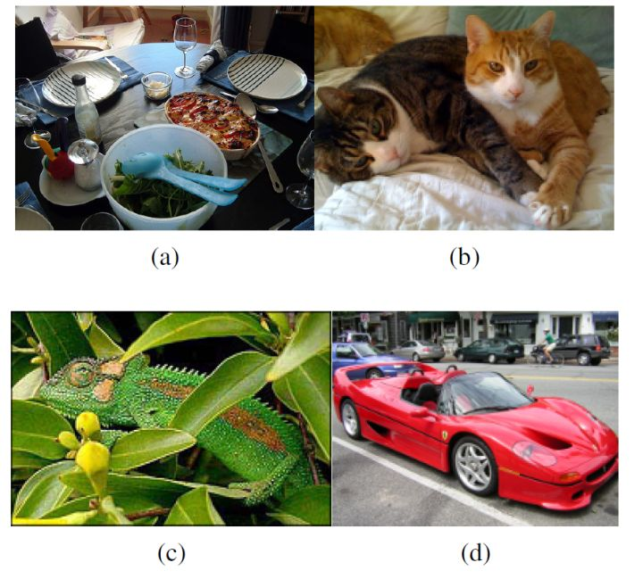
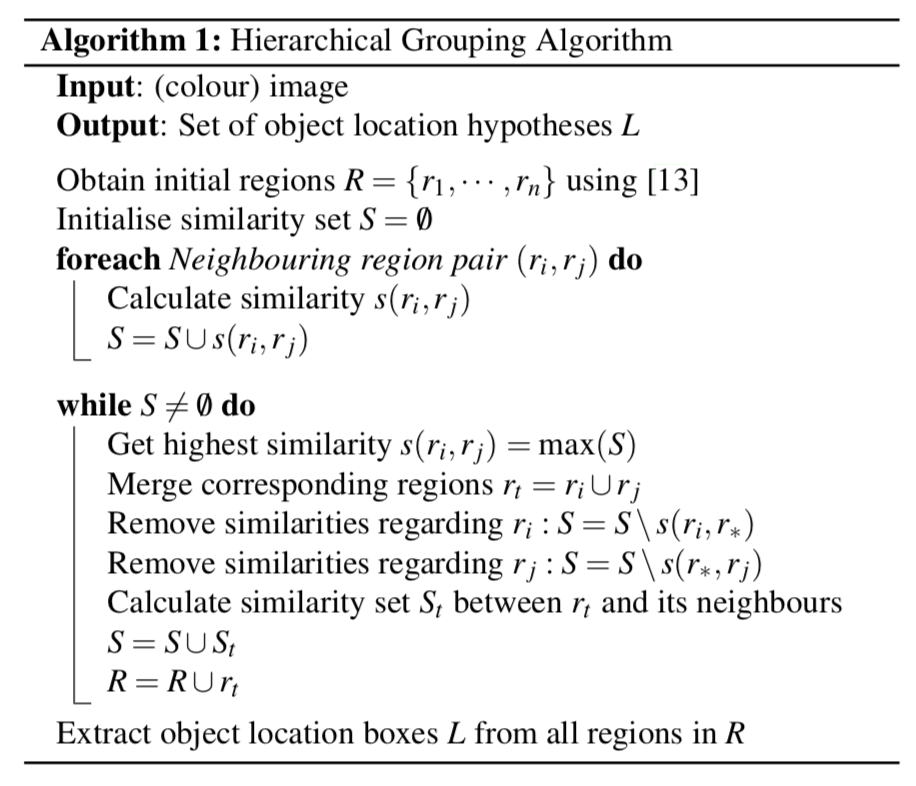
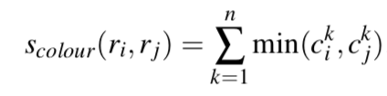
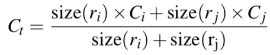
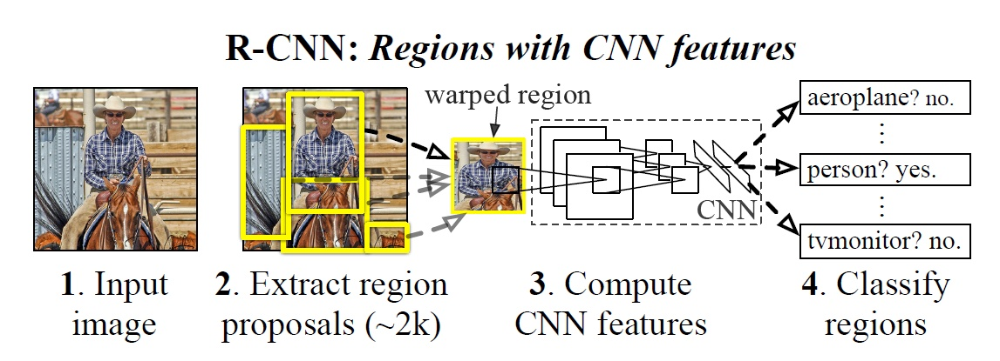

# Object Detection學習筆記 -- R-CNN

##問題描述： 
首先看下圖

在傳統的CNN影像辨識中，我們針對一張圖片去歸類其屬於某種特定類別，但在此處，我們希望能夠在一張特定圖片中找出所有我們感興趣的類別，而不單單只是輸出途中機率最高的某個類別。也就是說，我們並沒有特定要對圖片本身做分類，而是要對每個pixel做分類，也就是我們希望在圖片中找出每個pixel屬於什麼類別，比如在a圖中，我們可以看到有玻璃瓶、杯子、桌子、盤子等等物品，而這些物品有階層上的關係，如餐具在桌子上、勺子在碗內、調味料在盤子上等等。

傳統的方式是利用多種不同scale的window去做detection，但很明顯計算量太大而且這種窮舉方式是做不完的，因此首先的想法就是有沒有什麼比較低階的特徵使得我們可以利用其來判別物體類別的不同並減少計算量呢？此即為RCNN想要解決的問題。

一句話描述問題：**RCNN想要找出不同尺度的region並提取特徵以達成對每個pixel作分類的結果**

## 如何尋找好的region
接下來我們回頭想一下該怎麼達成這個目標，無論如何我們利用手動去抽取如texture，顏色等特徵是不實際的，比如像(b)中，texture相似，利用texture可能分不出這兩隻貓、(c)中則是顏色相同，可能找不出變色龍、而(d)中車體與車輪的差異性也極大，或許很難將兩者歸於同一類，因此我們有太多種可能性以至於以人手難以窮舉所有特徵，那該怎麼做呢？

首先在[這篇論文](http://www.huppelen.nl/publications/selectiveSearchDraft.pdf)中提出了一個想法，首先我們不知道每個物體的尺度，那我們就只好盡量對所有可能的尺度進行搜尋，但其想法是我們從小尺度的區域逐漸合併成為大尺度的區域，並且對這些大小區域當中進行分類，首先我們先看論文中產生這些多尺度區域的演算法如下：

首先，將圖片切成許多小區域作為初始化，初始化方法如論文中的參考資料[13]，接下來計算所有相鄰區域的相似度並紀錄（也就是切成m個region，那麼會有(m-1)+(m-2)+...+1對）到<math><mi>S</mi></math>中。

接下來每次合併相似度最高的兩個區域<math><msub><mi>r</mi><mi>i</mi></msubsup></math><math><msub><mi>r</mi><mi>j</mi></msubsup></math>，此時我們得到一個新的region <math><msub><mi>r</mi><mi>t</mi></msubsup></math>，將其加到<math><mi>R</mi></math>中，並且在<math><mi>S</mi></math>中去除所有與<math><msub><mi>r</mi><mi>i</mi></msubsup></math><math><msub><mi>r</mi><mi>j</mi></msubsup></math>相關的region，也就是我們取得最大的相似度pair並且合併後，接下來我們只會考慮這個合併後的圖像，合併前的region就不再參與之後的合併了。最後，我們會得到一張所有區域都合併完畢的原圖像。

以上演算法，我們還不知道如何計算相似度，為了盡可能保留所有特徵，此論文中透過把原始色彩空間轉換到八種的色彩空間，並透過不同的距離計算方式來綜合顏色和texture等特徵資訊。

### 距離計算方式

1. 顏色距離

	
	
	對於某個region <math><msub><mi>r</mi><mi>i</mi></msubsup></math>，我們有一組colour histogram(每個channel一組)
 <math><msub><mi>C</mi><mi>i</mi></msubsup></math>={<math><msubsup><mi>c</mi><mi>i</mi><mi>k</mi></msubsup></math>...<math><msubsup><mi>c</mi><mi>i</mi><mi>n</mi></msubsup></math>}，對各channel計算顏色的histogram，並且取對應bins的最小值(註：這看起來太怪洨了，我無法理解為何取min代表距離，這樣黑色不就跟大家顏色都很近)。
 
2. texture距離

	見論文，利用sift計算特徵（8方向3通道，每個通道有10個bin），一樣取min(WTF)。
	
3. 優先合併小region

	小region在選擇上會得到較高的分數，讓圖像上不同位置的region都有多尺度的合併機會。
	
4. 估計region合併後的狀態

	合併後的region不該出現hole或是gap，這代表了這兩個region可能並不適合被同一個上層region所包含
	

將以上四種距離加權相加即為區域間的距離定義。

如此以來我們就可以從最小的region到最大的region間，能夠有一系列不同位置及不同大小的尺度，用此來取代窮舉window的方法。

## R-CNN的架構
談論完如何選取region後，接下來進入R-CNN的架構如圖：

0. 先用ILSVRC2012的資料訓練CNN，此時並沒有切割成window來train
1. 對每張輸入圖片，先由以上的方式來選取各種尺度的region，選2K個信心度最高的
2. 各種尺度的region縮放成同樣大小的圖片(227x227 in paper)
3. 針對這些圖片做傳統的分類問題，把0中的CNN，換掉分類目標為N+1(N為有幾種物品(VOC:N=20, ILSVRC2013: N=200)，+1為背景)在此處分類正確要同時物品類別正確且IoU要>=0.5，否則為分類錯誤
	* 在論文中使用32 positive windows(over sampled for rare positive cases)及96 background windows(在後文中判斷應該即為negative samples的一部分)
4. 利用CNN所得出的這些feature(FC7 in paper, 實驗結果決定)丟到SVM後進行分類
5. 對SVM分好類的region proposal做bounding-box regression，目的為讓region proposal和ground truth更吻合

### Note
* Bounding-box regression：先做平移，再做縮放，詳情可見[這裏](http://caffecn.cn/?/question/160)
* IoU(Insersection over Union) = Area of Overlap / Area of Union
* 在svm的部分，每個class都會有一個svm負責分類bounding-box的類別(e.g.,是汽車or不是汽車)
* 一樣svm的部分，訓練上positive sample僅使用ground truth，negative sample則採用IoU < 0.3的圖像，其他都忽略不計，因此訓練方式我猜大概是這樣：
	1. 某個region經過訓練好的CNN得到encode後的資訊
	2. 這個region分到每個類別去訓練svm們，如果
	
		(1) 在那個類別中對應的ground-truch與其IoU>0.3 => 忽略
		
		(2) 在那個類別中對應的ground-truch與其IoU<=0.3 => 此為negative sample，即為分類錯誤的例子，記錄下來(紀錄的是encode後的資訊，而非整個region)
		
	3. ground-truth就不用經過CNN，直接丟到對應類別的svm中當作分類正確
	4. 拿2, 3的結果就能訓練svm囉
	
* Q: 2K個region是不是太多? A: 會利用以下演算法擷取區域：
	1. 將region從信心大到小排列(假設為abcde)
	2. 假設a與b、c的IoU大於某個閥值(論文貌似沒寫這個值多少)則將會去除b、c，接著從d開始進行一樣操作，直到掃完
* 缺點：超慢超麻煩

